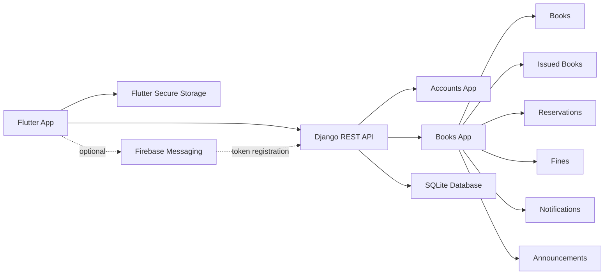

<div align="center">

# Library Management System

**A full-stack library platform built with Flutter and Django REST Framework**

From book discovery to borrowing, reservations, fines, announcements, and notifications, this project brings the day-to-day library workflow into one clean app for students and librarians.

<p>
  
  
  
  
</p>

</div>

---

## Why This Project Stands Out

This repository is more than a basic CRUD demo. It combines a mobile-first Flutter client with a token-authenticated Django backend and models real library behavior:

- role-aware login for students and librarians
- book circulation with issue, renew, and return actions
- reservation queues with pickup windows
- overdue fine calculation and payment tracking
- announcements and notifications for live activity
- optional Firebase push support for mobile devices

## Experience Snapshot

| Student Experience | Librarian and System Logic |
|---|---|
| Browse books and check availability | Issue and return books through the API |
| View borrowed books and due dates | Track circulation state in SQLite |
| Renew eligible books | Promote reservations when copies free up |
| Join and manage reservation queues | Auto-calculate overdue fines |
| Review borrowing history | Register and unregister push devices |
| Read announcements and notifications | Support both token auth and session-aware app routing |

## Architecture



## Repository Layout

```text
.
|-- backend/
|   `-- server/              # Django project, apps, migrations, SQLite DB
|-- frontend/                # Flutter application
|-- run_dev.ps1              # Windows helper to run backend + frontend
|-- IMPLEMENTATION_GUIDE.md  # Additional project notes
`-- README.md
```

## Tech Stack

| Layer | Tools |
|---|---|
| Frontend | Flutter, Dart |
| Backend | Django 5, Django REST Framework |
| Auth | DRF token authentication |
| Data | SQLite |
| Notifications | Firebase Cloud Messaging, flutter_local_notifications, Workmanager |
| Local storage | flutter_secure_storage, shared_preferences |

## Quick Start

### 1. Backend

```powershell
cd .\backend\server
python -m venv .venv
.\.venv\Scripts\Activate.ps1
pip install -r requirements.txt
python manage.py migrate
python manage.py seed_data
python manage.py runserver 0.0.0.0:8000
```

Backend base URL:

```text
http://127.0.0.1:8000/api/
```

### 2. Frontend

```powershell
cd .\frontend
flutter pub get
flutter run
```

### 3. One-command Windows flow

```powershell
.\run_dev.ps1
```

`run_dev.ps1` starts Django, launches `flutter run`, and attempts `adb reverse` when available.

## Frontend Networking Notes

The app automatically picks a backend base URL depending on platform:

| Platform | Default backend URL |
|---|---|
| Web and desktop | `http://127.0.0.1:8000` |
| Android emulator | `http://10.0.2.2:8000` |
| Real Android device | pass `--dart-define=API_BASE_URL=http://<LAN_IP>:8000` |

Example:

```powershell
cd .\frontend
flutter run --dart-define=API_BASE_URL=http://192.168.1.100:8000
```

## Demo Credentials

After running `python manage.py seed_data`, you can sign in with these demo student accounts:

| Username | Password | Student ID |
|---|---|---|
| `student1` | `student1` | `202400001` |
| `student2` | `student2` | `202400002` |
| `student3` | `student3` | `202400003` |
| `student4` | `student4` | `202400004` |
| `student5` | `student5` | `202400005` |

The login flow accepts either:

- username + password
- student ID + password

If you want a librarian login, create a Django user and set `role = librarian`.

## API Overview

Base URL:

```text
http://127.0.0.1:8000/api/
```

### Authentication

- `POST /auth/login/`
- `POST /auth/logout/`

### Books and Circulation

- `GET /books/`
- `GET /books/search/`
- `GET /books/{id}/availability/`
- `GET /borrowing/my_books/`
- `POST /borrowing/issue/`
- `POST /borrowing/{id}/renew/`
- `POST /borrowing/{id}/return_book/`

### Student Services

- `GET /history/my_history/`
- `GET /reservations/`
- `POST /reservations/reserve/`
- `POST /reservations/{id}/cancel/`
- `GET /fines/`
- `GET /fines/summary/`
- `POST /fines/{id}/pay/`
- `GET /alerts/upcoming/`
- `GET /notifications/`
- `GET /notifications/unread_count/`
- `POST /notifications/mark_all_read/`
- `POST /notifications/{id}/mark_read/`
- `GET /dashboard/summary/`

### Push Device Registration

- `POST /push-devices/`
- `POST /push-devices/unregister/`

All routes except login require:

```http
Authorization: Token <your_token>
```

## Example Login Request

```bash
curl -X POST "http://127.0.0.1:8000/api/auth/login/" \
  -H "Content-Type: application/json" \
  -d '{"username":"student1","password":"student1"}'
```

Expected response shape:

```json
{
  "token": "<token>",
  "username": "student1",
  "user_id": 1,
  "role": "student",
  "student_id": "202400001"
}
```

## Optional Firebase Push Notifications

Push notifications are optional for local development. The Flutter project already includes Firebase client configuration files, and the backend can register device tokens when credentials are available.

Start Django with Firebase credentials:

```powershell
$env:FIREBASE_SERVICE_ACCOUNT_PATH="C:\path\to\firebase-service-account.json"
python manage.py runserver 0.0.0.0:8000
```

Alternative environment variable:

```powershell
$env:GOOGLE_APPLICATION_CREDENTIALS="C:\path\to\firebase-service-account.json"
```

If you need to regenerate Flutter Firebase config:

```powershell
cd .\frontend
flutterfire configure
```

## Data and Seeding

The backend seed command populates the app with useful demo data, including:

- sample books
- student users
- active borrowings
- history records
- fines
- reservations
- announcements
- notifications

The repository also currently contains a local SQLite database file at `backend/server/db_role_based.sqlite3` for demo use.

## Project Strengths

<details>
<summary><strong>What the backend handles automatically</strong></summary>

- reservation queue ordering
- expiration of pickup windows
- promotion of pending reservations when books become available
- overdue fine synchronization
- token-based authentication

</details>

<details>
<summary><strong>What the Flutter app handles</strong></summary>

- role-aware startup routing
- secure token persistence
- dashboard flows for student and librarian roles
- in-app notifications and unread counts
- demo UPI deep-link payments for fines
- optional background notification syncing on supported platforms

</details>

## Development Notes

- CORS is enabled for local development
- fine amounts are handled in INR
- the app is well suited for demos, coursework, and portfolio presentation
- this repo is not yet production hardened for security, secrets, deployment, or large-scale usage


